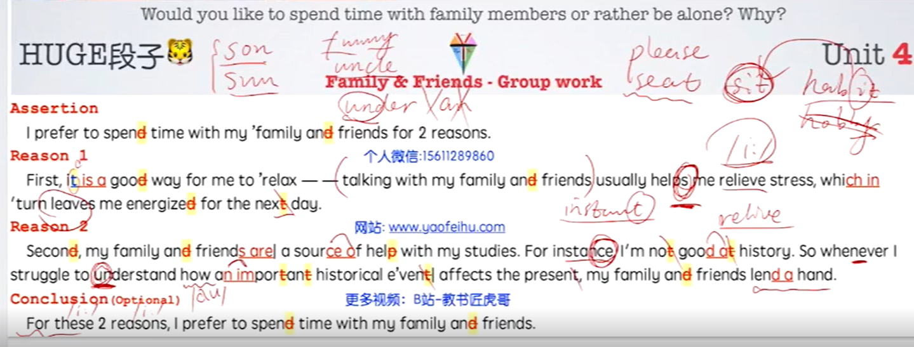
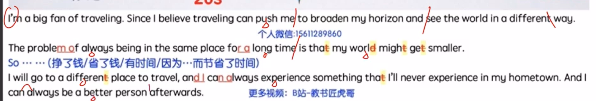
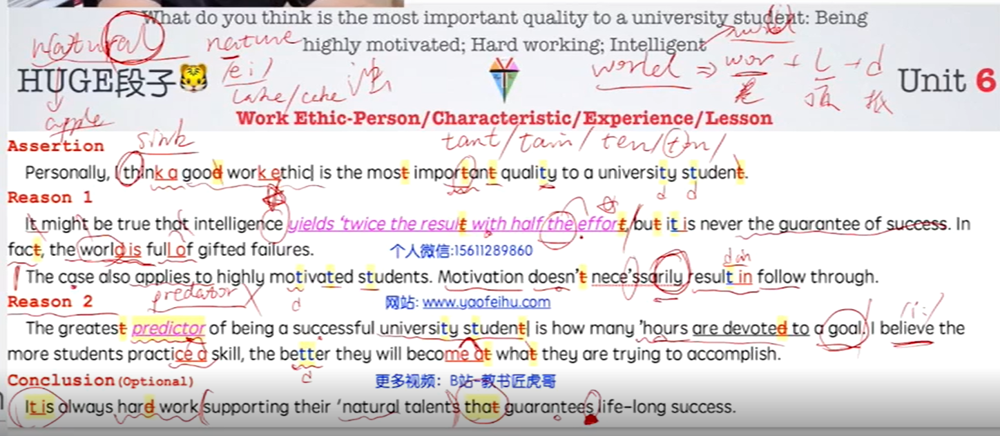
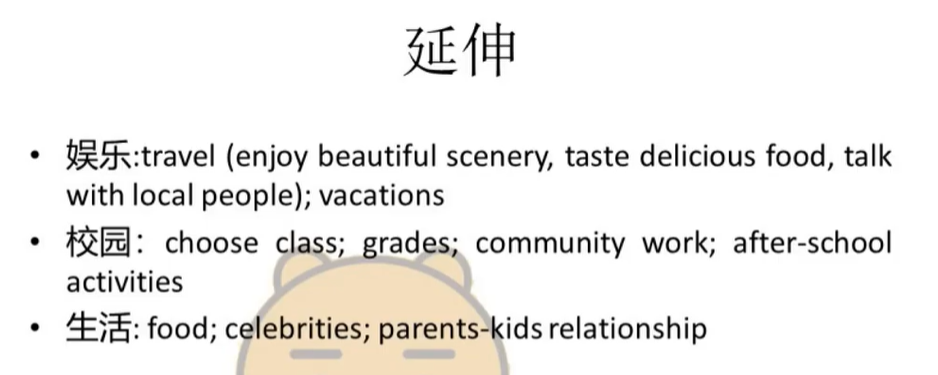
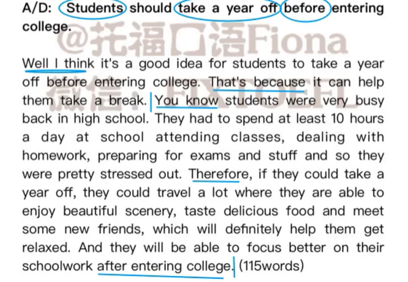
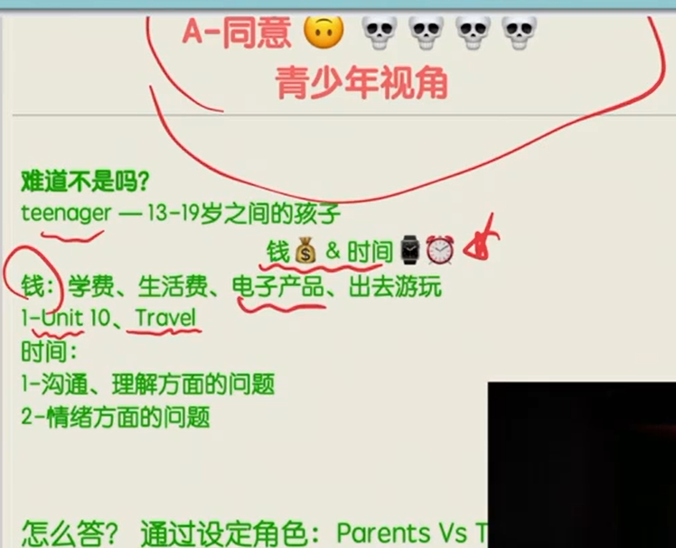

# Speaking Notes

## Task1

（首句不用转述，按照原词念就可以）35

15

### 话题积累

##### 4、family & friends

注意nut和not的区别！

这个素材的适用范围：所以一人 vs 集体（要involve other people）的题目，都可以用这个段子来说。

##### 5、travel

I'm a big fan of traveling. Since I believe（元音注意长度要发足、发饱满） traveling can push me to broaden my horizon and enrich my knowledge.

The problem of always being in the same place for a long time is that my world might get smaller.

So as long as ... （挣了钱/省了钱/有了时间/因为...而节省了时间）I will go to a different place to travel, and I can always experience something(闭唇！咬舌！) that I'll never experience in my hometown/ if I keep staying in on my campus all the time. And I can always be a better person afterwards.

==适用范围==：这个段子之所以重要，是因为可以作为跳板性思路。

##### 6、work ethic

#### 万能视角

| 视角\拓展方向        |                                                              |      |      |      |
| -------------------- | ------------------------------------------------------------ | ---- | ---- | ---- |
| money                |                                                              |      |      |      |
| time                 |                                                              |      |      |      |
| good mood            |                                                              |      |      |      |
| health               | resotre the engery; which in turn creates a vicious circle   |      |      |      |
| improve relationship | create/make new ==memories== with them⬅①make them a meal, ②visit scenic areas and take lots of photos (look back) |      |      |      |
| improve skill        |                                                              |      |      |      |
| freedom / privacy    |                                                              |      |      |      |

#### 自我 

#### 家人 

##### 1.

**When** celebrating important events with my family, **I like to spend time making** new memories with them. For example, I could make them a meal that makes them happy, **or** we could go to a park or museum that they have been wanting to visit. I **would** take lots of photos, **so that even after** the event is over we can look back and see the happy memories. Physical gifts can break or become outdated over time, **but** memories can last forever and continue to make people smile for a long time after the event has passed. 

#### 朋友 

#### 老师 

#### 同学

#### 领导 

#### 同事

### 1. Students should take a year off before entering college.

（总观点）I personally believe it's a good idea for students to take a year off before entering college, （分论点）mainly because it can help them take a break.（解释）You know, 

==要死了erererer==

## Task2 

### Q49 - 0917

In the letter, a student

## Task3 130-160

### Q46 - 0914

阅读不能快速抓住要点。

听力大致都能听明白。可是不能**快速组织语言**。有没有什么练习可以做啊。

这篇听力的形式是，两点对臭鼬的介绍 + 一个臭鼬大战野狼的例子。所以对于时间的控制是两点介绍说完应该至少还剩20’。

一个感受是，关注时间，至少要把关键词都踩到，不要在发音或者语法上苛求了。最重要的是回答内容的完整性。

Warning coloration **means that** some animals have a distinct coloring **to** remind the predators of their defense mechanism.

The professor elaborates on this **by giving** an example of skunk. First, skunk has a distinctive marking. Its body is mostly dark **but with** a white stripe runs from head to tail. **In this way**, skunks **can be** seen and recognized **even at a far distance**. Second, sunk can produce a bad-smelling liquid **from** the glands under their tail. **For example, say** a wolf wants to attack a skunk, **and as the wolf approaches**, the skunk will lift its tail and sprays the wolf, **which makes** the wolf very uncomfortable **so** it backs off and run away. **From then on**, **whenever** that wolf sees the marking of skunk, it will recall that unpleasant memory and stay away from it.

### Q47 - 0912

（According to the reading,） reactance means that in order to restore/regain freedom, people will directly oppose the regulation when their freedom is unfairly limited. The professor elaborates on this by giving two examples. First, imagine a kid who often goes to a playground and has a lot of fun. However, his parents suddenly don't allow him to go there anymore for no reason.  The kid thinks it's unfair and wants to play there even more than before. He will sneak to the playground despite the rule. Second, a town decided to ban the sale of a soap because an ingredient in it is harmful to the environment. But the clean ability of the soap is good. However, people became upset because they thought they should be able to buy whatever they what. As a result, a week before the policy went into effect, people went to buy a lot of this soap, way more than they would in other situations.

【应该用什么时态呢?】

### Q49 - 0917

问题还是阅读看不完，不能快速抓住中心句。可以尝试直接跳到末尾。

（0920）第二次做的时候，发现记笔记盖过了听听力，不能每一个词都记，来不及，反而会分散听力的专注性。怎么办呢，两句记一次。

说的时候暴露出来的问题有：笔记里有关键词，但是不知道怎样完整地表述这个语义，就会磕绊很久，浪费很多时间。主要还是因为听力原文没抓住。？

（According to the reading,） procedural memory means the process of performing a task become automatic with practice, which allows people to perform the task easily even after many years.10

 The professor elaborates on this. When he was a little boy,  he took a guitar lesson and he practiced it for hours after class every day. After years of practice, he could pick up the guitar and starts playing without thinking. **But** after college, he quitted playing it. One day, **however**, he saw the old guitar and surprisingly, he could still pick up the guitar and start playing. He knew automatically where to put the fingers and which string to stress. Even though he couldn't explain why or how could he do so, he could just still easily paly his favorite songs.

## Task4

### Q49 - 0917 群居的劣势*2

In the lecture, the professor talks about two disadvantages of  living in groups for animals. 50

First, animals that living in groups are more visible to predators **because** they are more easily to be spotted than an individual would be.【因果、对比】 For example, sardines live in group and whales feed on them. **While** the predator wouldn't notice one single sardine **since** it's so small, it could see groups of sardines and **then** capture them for food. 【让步、对比】25

The second disadvantage is caring for the young. **When** living in groups, **it is difficult** for the parents to find and identify their own baby.【因果】 For example, a kind of bat live together in one same cave, millions of that bats. And the cave is **so crowded that** when a mother bat returns from finding food for her babies, she **might end up** feeding other's babies **instead of** her own baby.【因果、对比】

## 如何快速组织语言

想要口语说的流利，一定要进行**整句练习**，不然容易磕磕绊绊的。这个练习可以分成两方面：

对于一些**常用的句子**，多练，练到非常流利乃至想到就能顺口说出来的地步。比如学习中的“It's common that we are suffered from mental problems like [anxiety](https://www.zhihu.com/search?q=anxiety&search_source=Entity&hybrid_search_source=Entity&hybrid_search_extra={"sourceType"%3A"answer"%2C"sourceId"%3A"2458811255"}), depression and lack of confidence.”这些句子出现频率高，说的流利些，考场上绝对是加分项。

对于一些**常见的句型**，多练，多用。知道我们能自然的将想表达的意思通过这类句型表达出来，就比如我们能很轻松的说“I like play video games”，这个很简单，但是我们要训练到能表达成“ Video games are quite attractive to me”就不是很容易了，需要多练，将这种物品做主语的句型练得熟练。

## 特制单词

- arctic  n.北极

  that's how the arctic ground squirrel is able to cope in this extreme environment

- insulate v.使隔热/隔音/绝缘；使隔绝

  You can insulate a house **against** heat loss by having the windows double-glazed.

  Children should be insulated from the horrors of war.

- adaptation n.适应；改编

  Evolution occurs as a result of adaptatin to new environments.

  even different parts of a reindeers leg are **adapted** for optimal cold weather performance.

- extremity n.末端，尽头；身体末端

## 从听力lecture中总结的句型

1. Newborn reindeer are very adult-like, **like** they **can** stand ==as soon as== they're born, **and** ==by their second day== they **can already** run as fast as a human.
2. Food **is very scarce** in far north, **so** reindeer herds **have to** cover lots of ground every day.
3. ... **so that means** they can allocate less energy **to** heating their extremities, and more energy **to** maintaining stable temperature in their body core, **where** their vital organs are located. 
4. ...**but even** different parts of a reindeers leg ==adapted== for optimal cold weather performance.
5. Reindeer also eat a number of different plant species **that** most animals are  not very interested in. **Which means** thay don't have a lot of competition **when it comes to that food**.

### 独立口语

这部分我最开始其实很担心，想着这题就算让我说中文我都不知道该说啥能撑到45秒。

参加口语营后我只背了HUGE的十个段子，其他啥也没背，考试之前淘宝上随便花了20块钱买了机经（我觉得机经存在的意义并不是考试能不能中，而在于你有了更多可以练习的真题，可以提高你的反应能力和应试能力，也就是编故事的能力）。

开始用段子一个一个题的套，一天练5题，到最后我就发现，没有什么是不能套的，关于如何套，下面举一些方法希望能够给大家帮助和借鉴：

###### 1）回答时把自己赋予一种特殊的人物性格。

可以是很累的student，很缺钱的student，a person who loves to socialize with other people，或者害羞不爱交际的。

不要管你是不是真的是这种人，只要你有一种强烈的人物性格，你就会做出什么样的选择，这是回答的最简单最好用的开端。

###### 2）开头有了，就是展开了，虎哥段子里有很多搭配很万能，什么都能搭上。

展开方式我主要用降级，列举和举例。最常用举例，就是时间人物地点事件，说全了我就不信还不到45秒。

我最常用的就是relax，比如那些问我三选一选哪个的话题，我一般给出的理由都是做这件事可以放松，可以交朋友，然后结果如何，以及我的感受（这里积累一些很简单的感受的词汇就可以比如happy, excited, exhausted, angry）。

###### 3）当然，总会碰到一些摸不着头脑的题。

有些题会给两个选项让你选其中一个，比如我备考的时候碰到一个题是in order to succeed in study or job, the ability to adjust or adapt to changing condition or circumstance is more important than having knowledge. 

我最开始看到觉得这题两个ability我觉得都不好讲，思考了好久我突然想到，**口语考的到底是什么？并不是你的回答到底对不对或者多有深度，他只是想看你的交流能力。**

那么就说实话I think neither of them is important，捎带提一提一两句原因，然后扯到熟悉的段子a good work ethic上去。

总之，口语跟写作不一样，他不需要你100%完全切题，也不需要回答的有深度，重要的就是keep talking和避免语法错误。

所以有时候看到有人备考期间问大家某个题有没有思路的时候，我觉得其实就是没有理解到口语考察的重点吧。

多练练常用语……虽然这个建议听起来很平平无奇，但是你试一下就知道真的会有用，比如一些串联词，关联词，还有歪果仁打磕巴的时候会用的缓解尴尬的词语e.g. U know… kind of…just like…，平时要有意识地把这些东西填到自己本来会emmmm的地方，录几遍音就会感觉到和之前emmm那种好像挤不出牙膏的感觉是完全不一样的。

除此之外，虎哥在独立和综合口语的练习中，强调要通过反复的练习，将一个答案说到最好，而非泛泛的练习，产出许多质量不高的答案。通过反复揣摩提升同一个答案，我们能够在潜移默化中学习怎样组织答案，怎样规划时间，运用哪些句型词汇等等。当答案说得越来越完美时，下一次接触新的题目时也能用更少的练习遍数说出更好的答案。另外，在综合口语的反复练习中，不光是要将答案重新阐述，也应重新听听力，做笔记。这样才能更好的学习如何合理地规划笔记，并从笔记中去组织更好的答案。

### 综合口语

**还有一点我觉得很重要：虎哥的示范很厉害。**

但是我发现我没有办法做到像他那样回答自如又能把听力大部分的点都提到，最开始很是苦恼，一直加快语速赶着赶着说完，后来我想想，自己又不是30分的水平，何必强求每句话都涵盖呢。

所以我后来练的时候，每个分论点不超过三句话，比如Task3的学生观点，他两个大点下面每个小点如果说五句，我全记，每句都记不好也说不好，所以我就只记最多三句，大部分时候只说其中一到两句，这样的好处是说的慢一点发音就很清楚，并且给你更多的时间思考和注意你表达时的语法问题。

事实上，我考试的时候task3至task6每个小分论点只说了顶多两句话，结尾都剩余了一点时间（最长的有一个剩余了8秒）可以用来总结so here is the proposal and the discussion between the boy and the girl…（撑满60秒你就赢了）。

此外，还有一个小技巧，每个task听力结束之后会有一段停顿然后再开始准备时间一共有几十秒，我听力一结束就会开始讲，讲到正式开始录音的时间那会，差不多能讲完一半的内容。

这样的好处就是相当于给了两次的机会，第一次讲的时候肯定会有一些结巴的部分，第二次讲的时候就会顺畅很多，这样开头顺畅，也不会那么紧张啦。

*「关于考试」考试当天我带了薄荷糖和很酸的李子，中途休息的时候吃完之后说口语感觉比吃完巧克力说好很多哈哈哈，大家可以试试。*

初期做题时我会先浏览老师提供的信号词再播放听力，两三篇之后有感觉了就直接放听力了，但听完后还是会扫一遍信号词，**毕竟听力中预判真的很重要。**

 

听力提升是需要一定时间的，三五天就想达到一个突破几乎不可能。

 

前期的训练确实很煎熬，可能觉得花了很多时间在听在练却还是没有一个明显的效果，这时候一定一定要稳住心态，收获都在后面呢！

 

## 口语营14天记录

### Day1

#### 跟读&复述方法论

跟读务必保证质量，力求改变语音面貌。语速、语音、语调、连读、吞音、重读、停顿etc，重点信息的预判&定位信息

==跟读步骤：==

- 首先朗读+录音，dayx+partx+第一遍
- 对比音频，记录语音现象的不同（连读、吞音、变音影响语速/重读、停顿、拖音影响表达重点/语调上扬和下降影响表达节奏） + 发音和内容的不同，这样就定位了问题所在
- 听语音现象的讲解视频
- 开始逐句模仿，直至达标
- 发到群里批改

==复述步骤：==  注意是复述而不是转述噢。

- 复述不是背诵，复述的核心在于**“听”**，内容和“旋律”配合
- 逐句放音，（不可以看原文内容）复述原文，要通过听就完整准确地复述出来（在3遍以内完成）。复述里发现的不一致，就是我们的问题所在
- 每新练一句前，做过的句子们都能串起来（不要看原文，只听音频）

提升大脑对于大量音频信号的处理能力

#### 独立口语方法论 

一个好的模板，考场上肯定用得上。

根据题目的关键词，迅速进行思路的拓展、进行语言的组织。

#### 综合口语方法论

阅读部分说20s，听力部分说40s。说到听力最后一个reason的时候至少有15s。

阅读记笔记的时候先记录标题（带动词，无动词去后两行内找），然后先看落款，确定用哪一个模板

听力记笔记的时候要缩进（重要的放头前，后面的支撑原因缩进。一句就一行，不要都堆在一起）、分区（上下，不要左右堆砌，否则容易串行）、有主次（动词最重要，其他的辅记，或用缩写）。

#### Day1 独立口语

Agree or disagree: Teenagers cause many problems for their parents.

I agree with the saying that teenagers may cause many problems for their parents. Because when I was a teenager, I had a very money-consuming interest, which is traveling. Since I believe that traveling can push me to broaden my horizon and enrich my knowledge. You know, my parents also told me that the problem of always being in the same place for a long time is that my world might become smaller. So as long as I can have a long vacation, (and save up enough money,) I would go to some place new and some place different to travel, so that I can always experience something different. But since I always ask for money from my parents I think I caused one of the problems for them. So I agree that teenagers may sometimes ...

#### 练习记录

跟读的问题：

1、语速过慢，无语调

2、吞音会嘴瓢

3、其他的语音现象都理解得挺好的（？），但是不知道节奏、停顿怎么把握。

4、对重音的敏感度比较低

综合口语的问题：

1、阅读来不及

2、听力笔记记录和听在打架，没办法一心二用

